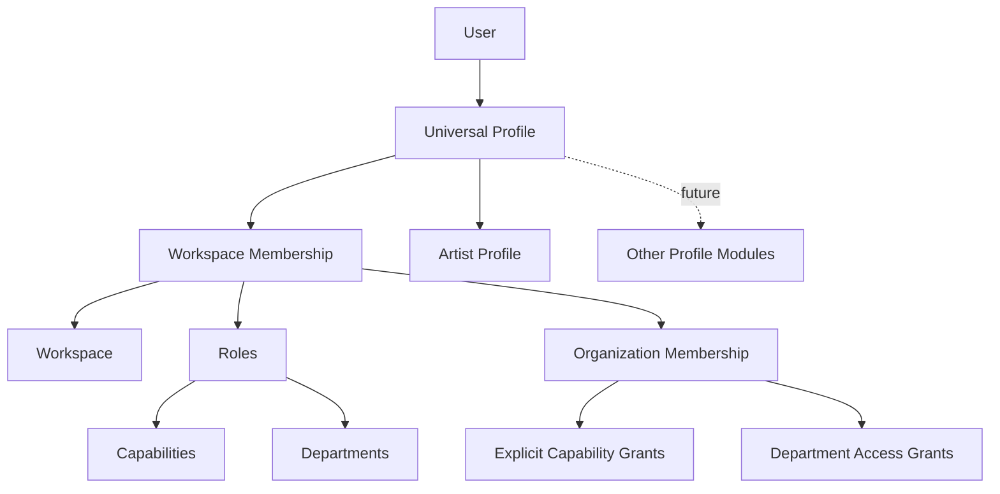
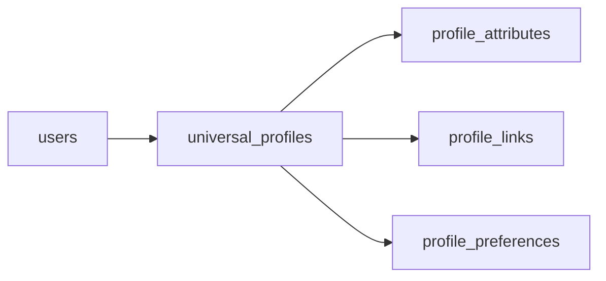
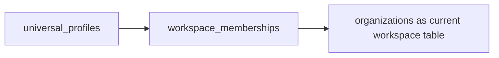
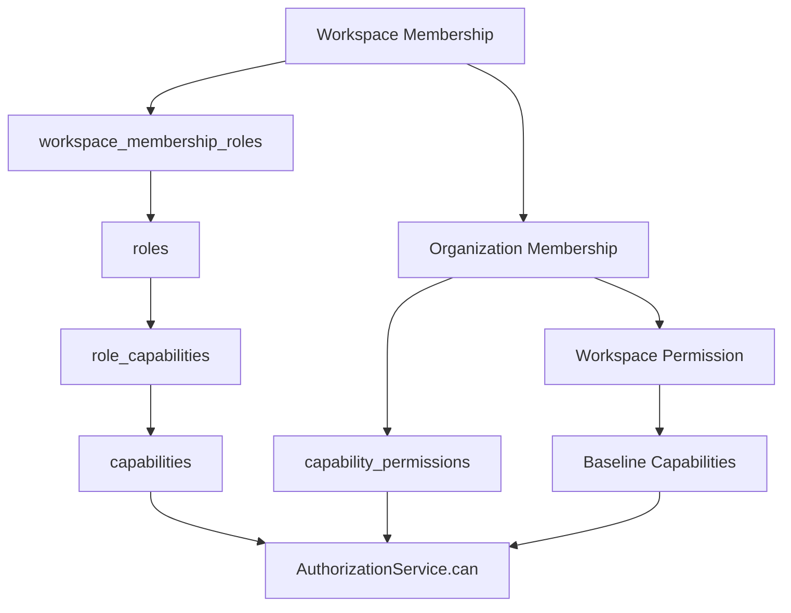
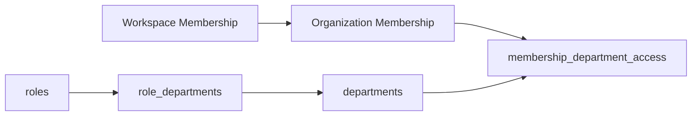
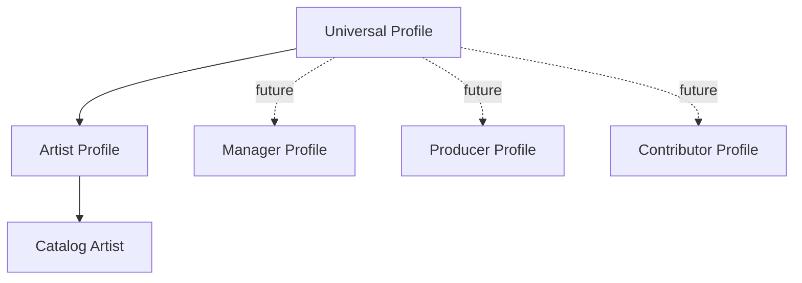
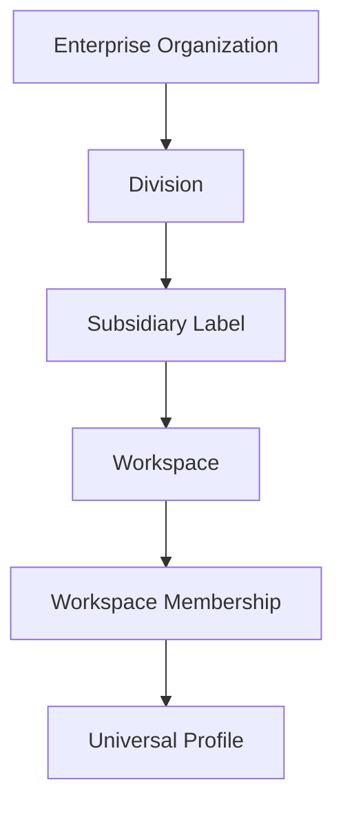

# Universal Profile Architecture

The Universal Profile System is the person identity layer for LabelOS. It keeps
durable user identity separate from workspace membership, authorization, and
specialized domain profiles.

## Core Model

The model has five intentional layers:

| Layer                    | Entity                                          | Responsibility                                                                           |
| ------------------------ | ----------------------------------------------- | ---------------------------------------------------------------------------------------- |
| Identity                 | `User` -> `UniversalProfile`                    | Authentication account and durable person identity.                                      |
| Workspace context        | `UniversalProfile` -> `WorkspaceMembership`     | The same person can participate in multiple workspaces with different status and access. |
| Authorization            | `WorkspaceMembership` -> `Role` -> `Capability` | Workspace-scoped action authorization.                                                   |
| Organizational context   | `Role` -> `Department`                          | Functional work areas and default department access.                                     |
| Specialized profile data | `UniversalProfile` -> profile modules           | Optional domain-specific profile records such as `ArtistProfile`.                        |

## Identity

`User` represents the authenticated account. It stores login-facing identity
and WorkOS linkage.

`UniversalProfile` represents the durable person profile. It owns shared profile
fields such as display name, legal name parts, slug, headline, biography,
avatar, location, timezone, primary email, profile status, onboarding status,
links, attributes, and preferences.

`UniversalProfile` is not owned by a workspace. Do not add workspace-specific
columns to it. Workspace-specific state belongs on membership records or on
workspace-owned domain tables.

## Workspace Context

`WorkspaceMembership` connects a universal profile to a workspace. It is the
profile-facing workspace participation boundary for a person.

`OrganizationMembership` is the current WorkOS-backed administrative membership
record. It stores workspace permission, WorkOS membership linkage, explicit
capability permissions, professional role links, and persisted department access
grants. Treat it as part of the same conceptual workspace membership boundary
when reasoning about authorization.

Use membership records for:

- workspace participation status;
- workspace-local profile listing and people directory behavior;
- workspace role assignments;
- department access grants;
- explicit capability grants;
- future collaboration scope.

Use `workspace_id` in profile and authorization code. The current backing table
is `organizations`, but application code should treat it as the present
workspace container rather than a permanent enterprise hierarchy.

## Authorization

Authorization is workspace-scoped and deny-by-default.

The effective capability set comes from:

- baseline capabilities implied by `workspace_permission`;
- capabilities attached to assigned workspace roles through `role_capabilities`;
- explicit membership capability grants on the membership record.

Owners are treated as having all capabilities. Other memberships receive only
the union of their baseline, role-derived, and explicit grants.

Backend routes should enforce authorization through
`labelos_api.authorization.AuthorizationService.can(...)` or FastAPI
dependencies such as `require_capability(...)`. Frontend helpers may hide or
disable controls, but they are presentation only.

## Profile Field Visibility

Universal Profile fields are not all equally shareable. Backend responses are
responsible for enforcing field visibility; frontend route protection is not a
privacy boundary.

Current visibility rules:

- Self reads through `/profiles/me` may include private preference values.
- Shared workspace profile reads may include workspace-visible identity fields:
  display name, headline, biography, avatar URL, location, profile status,
  onboarding status, links, attributes, module presence, and completion state.
- Shared workspace profile reads must not expose another person's private
  preference values. The API preserves the response shape by returning default
  preference values for non-self reads.
- Workspace people directory responses should stay summary-oriented and avoid
  preferences, personal email, legal name fields, and private settings.
- Future sensitive fields, Creative Memory summaries, legal identifiers,
  financial preferences, or notification settings must be self-only or governed
  by an explicit workspace capability and department policy before exposure.

## Organizational Context

Roles describe professional or operational functions. Departments describe work
areas such as legal, finance, marketing, releases, A&R, analytics, creative,
and administration.

Roles can define default department associations, but department access is
persisted on the membership. This allows onboarding defaults, manual approvals,
administrator grants, and future policy workflows to produce auditable access
records.

Department access is separate from action capabilities. A user may have a
capability such as `contract.create`, but a legal-scoped resource should still
require access to the relevant legal department scope.

## Specialized Profiles

`ArtistProfile` is the first specialized profile module. It stores
artist-specific profile fields such as stage name, genres, influences, imagery,
DSP links, catalog references, creative metadata, career stage, audience, and
preferences.

Specialized modules must not duplicate common person identity fields from
`UniversalProfile`. A person can have no modules, one module, or multiple
modules when product behavior supports multiple domain roles.

Catalog `Artist` records are workspace-owned resources and may exist without a
person-backed Artist Profile. `ArtistProfile` is created only when a
deterministic source maps that catalog artist to a `UniversalProfile`. Do not
derive that link from matching names, organization ownership, professional
roles, or invite metadata.

Use `ProfileModuleMixin` for future profile modules. Add new modules only when
there is a concrete field contract or workflow.

## Future Architecture

The current architecture is intentionally composable. Future systems should
attach beside the Universal Profile core through stable IDs instead of folding
their state into profile tables.

### Creative Memory

Creative Memory should be a separate subsystem. It can reference
`universal_profile_id`, `artist_profile_id`, and `workspace_id`, but it should
own memory records, sources, insights, embeddings, retention rules, and AI
provider metadata. Do not add memory JSON blobs or vector metadata to
`UniversalProfile` or `ArtistProfile`.

See `docs/development/creative-memory-integration.md`.

### Enterprise Organizations And Subsidiary Labels

Future enterprise hierarchy can be introduced beside workspaces:

Direct workspace membership should remain the first authorization source until
inherited policies are explicitly designed. Enterprise or subsidiary policy
inheritance should be added as a separate resolver layer, not by moving identity
or membership into hierarchy tables.

See `docs/development/enterprise-hierarchy-extension.md`.

### Cross-Workspace Collaboration

Cross-workspace collaboration can reuse the membership boundary. A collaborator
should receive a membership, invite, or collaboration grant scoped to each
workspace involved. Cross-workspace views should join through workspace IDs and
must evaluate authorization per workspace.

Avoid global shortcuts such as "same universal profile means same access."
Identity is global; access is workspace-local.

### Additional Role Types

Additional roles can be added to the role catalog without changing universal
identity. Roles remain workspace-scoped through `workspace_membership_roles`.
Use new roles to express professional function; use capabilities and department
access to express what the member can do and where they can do it.

### AI Agents Acting On Behalf Of Users

AI agents should act under an explicit actor model:

- the human `user_id` or `universal_profile_id` that delegated work;
- the `workspace_id` where the action occurs;
- the agent identity or service account;
- the capabilities and department scopes checked for the delegated action;
- audit metadata showing that the operation was agent-executed.

Agents should not bypass `AuthorizationService`. Agent permissions should be
derived from the delegating user, a workspace-approved service role, or a future
agent grant model.

### Contracts And Legal Permissions

Legal and contract workflows should combine capabilities with department access.
For example, uploading a contract should require a contract capability and the
appropriate legal or contracts department scope. Signature authority, approval
authority, and document visibility should be modeled as explicit capabilities
or legal-domain grants rather than inferred from display names or profile data.

### Artist Teams

Artist teams can be modeled as workspace-scoped relationships around
`ArtistProfile`, catalog `Artist`, and `WorkspaceMembership`. Team membership
should not be stored directly on `UniversalProfile`; the same person may be a
manager in one artist team, an artist in another, and an executive in a third.

### External Collaborators

External collaborators should use the same membership and authorization layers
with constrained workspace permissions, role assignments, department grants, and
capabilities. If they do not need a full account immediately, invites can
capture proposed roles and department access until account creation completes.

## Developer Recipes

### Add A Role

1. Add a stable role entry to `DEFAULT_ROLES` in
   `packages/database/src/labelos_database/roles.py`.
2. Add default capability associations in
   `DEFAULT_ROLE_CAPABILITY_ASSOCIATIONS` only for capabilities the role should
   receive automatically.
3. Add default department associations in
   `DEFAULT_ROLE_DEPARTMENT_ASSOCIATIONS` in
   `packages/database/src/labelos_database/departments.py`.
4. Add or update an Alembic migration to seed the new role and associations.
5. Update API schemas or frontend option lists if the role must be selectable.
6. Add tests for role seeding, membership assignment, and authorization effects.

### Add A Capability

1. Add the capability to the backend `Capability` enum in
   `apps/api/src/labelos_api/authorization.py`.
2. Add a stable capability entry to `DEFAULT_CAPABILITIES` in
   `packages/database/src/labelos_database/roles.py`.
3. Add role defaults in `DEFAULT_ROLE_CAPABILITY_ASSOCIATIONS` only where the
   capability should be automatic.
4. Add or update an Alembic migration to seed the capability and role links.
5. Add the frontend presentation constant in
   `apps/web/src/lib/authorization.ts`.
6. Protect backend behavior with `require_capability(...)` or
   `AuthorizationService.can(...)`.
7. Add allow and deny tests covering missing membership, inactive membership,
   missing capability, and department-scoped checks when applicable.

### Add A Department

1. Add a stable department entry to `DEFAULT_DEPARTMENTS` in
   `packages/database/src/labelos_database/departments.py`.
2. Assign an access sensitivity of `standard`, `elevated`, or `sensitive`.
3. Add role defaults in `DEFAULT_ROLE_DEPARTMENT_ASSOCIATIONS` when a role
   should be associated with the department.
4. Add onboarding or invite defaults in `DEFAULT_ROLE_DEPARTMENT_ACCESS` only
   when membership access should be granted by default.
5. Add or update an Alembic migration to seed the department and links.
6. Update API and frontend surfaces that display selectable departments.
7. Add tests for seeding, membership department grants, and resource-scoped
   authorization.

### Add A Profile Module

1. Add a relationship from `UniversalProfile` to the new module.
2. Add the relationship name to `PROFILE_MODULE_RELATIONSHIPS`.
3. Create a model using
   `ProfileModuleMixin` from `packages/database/src/labelos_database/models.py`.
4. Set `__profile_module_key__` and
   `__universal_profile_relationship__`.
5. Add only module-specific fields. Common identity fields stay on
   `UniversalProfile`.
6. Add an Alembic migration with a required `universal_profile_id` foreign key.
7. Export the model from `packages/database/src/labelos_database/__init__.py`.
8. Add model, relationship, API, and profile completion tests as needed.
9. Add routes and frontend UI only when the module has product behavior.

## Design Rules

- Universal identity is global; authorization is workspace-scoped.
- Workspace membership is the bridge between identity and authorization.
- Roles are additive; they do not bypass department access.
- Capabilities describe actions; departments describe work areas.
- Specialized profile modules extend a person without duplicating identity.
- Future systems should reference profiles through stable IDs and own their
  domain data separately.
